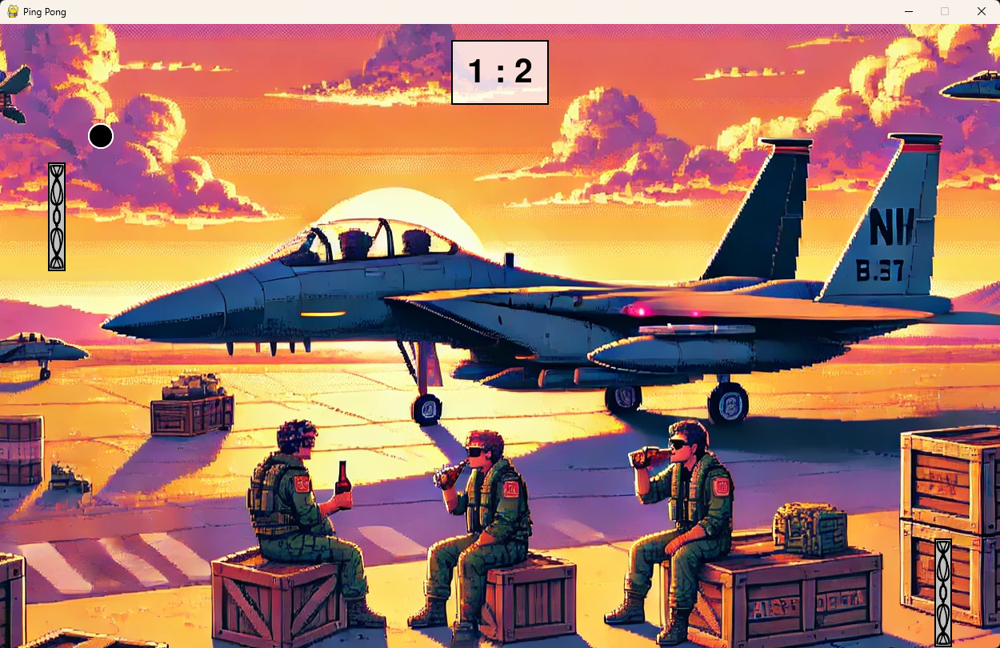

# Proyecto de Juego Ping-Pong

El objetivo de este proyecto ha sido desarrollar un juego clásico de Ping Pong utilizando Python y la biblioteca Pygame. 
Este documento describe paso a paso el proceso de desarrollo, explicando cada etapa y las decisiones tomadas durante la implementación del juego.



## Memoria de proyecto
**Alumnos** Iker Díaz-Maroto, David García y Roberto Carrascoso  
**Curso:** 1º CFGM SMR - Las Naves Salesianos
**Asignatura:** Fundamentos de la Programación

## Índice
1. [Configuración del Entorno de Desarrollo](#1-configuración-del-entorno-de-desarrollo)
2. [Estructura de Archivos y Recursos](#2-estructura-de-archivos-y-recursos)
3. [Controles del Juego](#3-controles-del-juego)
4. [Características Implementadas](#4-características-implementadas)
5. [Desafíos y Soluciones](#5-desafíos-y-soluciones)
6. [Conclusiones y Aprendizajes](#6-conclusiones-y-aprendizajes)
7. [Instalación desde otro equipo](#7-instalación-desde-otro-equipo)
8. [Reglas del juego](#8-reglas-del-juego)
9. [Recursos utilizados para crear el juego](#9-recursos-utilizados-para-crear-el-juego)
10. [Licencia](#10-licencia)

## 1. Configuración del Entorno de Desarrollo

Para comenzar con nuestro proyecto, necesitábamos preparar el entorno de desarrollo:

1. Instalamos Python en nuestros equipos
2. Elegimos Visual Studio Code como nuestro editor de código
3. Creamos un directorio para el proyecto
4. Instalamos la biblioteca Pygame con el siguiente comando:

   ```
   pip install -U pygame
   ```

5. Comprobamos la correcta instalación ejecutando un ejemplo de Pygame:
   ```
   python -m pygame.examples.aliens
   ```

## 2. Estructura de Archivos y Recursos

Tecnologías utilizadas
- **Python**: Lenguaje de programación principal
- **Pygame**: Biblioteca para desarrollo de videojuegos en Python
- **Programación orientada a objetos**: Para la estructura del código

Para nuestro juego, organizamos la siguiente estructura de archivos:

```
.
├── pingpong.py         # Archivo principal del juego
├── README.md           # Documentación del proyecto
└── assets/             # Carpeta con recursos multimedia
    ├── error.mp3       # Sonido cuando un jugador falla
    ├── fondo.png       # Imagen de fondo principal
    ├── fondo2.png      # Imagen de fondo alternativa
    ├── fondo3.png      # Imagen de fondo alternativa
    ├── musica.mp3      # Música de fondo
    ├── pelota.png      # Imagen de la pelota
    ├── raqueta.png     # Imagen de las raquetas
    └── rebote.mp3      # Sonido de rebote de la pelota
```

> [!NOTE]
> Todos los recursos dentro de la carpeta /assets son personalizables, es decir, puedes reemplazarlos por tus propios archivos y personalizar el juego a tu gusto.

## 3. Controles del Juego

- **Jugador 1 (raqueta izquierda)**:
  - **Tecla W**: Mover arriba
  - **Tecla S**: Mover abajo

- **Jugador 2 (raqueta derecha)**:
  - **Flecha arriba**: Mover arriba
  - **Flecha abajo**: Mover abajo

## 4. Características Implementadas

- Gráficos en 2D con imágenes personalizadas
- Sistema de físicas básico para el movimiento y rebote de la pelota
- Aumento progresivo de la velocidad para incrementar la dificultad
- Detección de colisiones entre la pelota y las raquetas
- Sistema de puntuación con marcador visual
- Efectos de sonido para rebotes y puntos
- Música de fondo
- Mensaje final mostrando el ganador

## 5. Desafíos y Soluciones

1. **Manejo de rutas de archivos**: Solucionado usando funciones de `os.path`
2. **Detección de colisiones**: Implementamos un sistema basado en coordenadas
3. **Velocidad de la pelota**: Ajustada mediante extensas pruebas
4. **Visibilidad del mensaje final**: Solucionado cambiando el color del texto

## 6. Conclusiones y Aprendizajes

Este proyecto nos permitió aplicar:

- Programación orientada a objetos
- Manejo de eventos
- Procesamiento de imágenes y sonidos
- Implementación de lógica de juegos

El resultado es un juego funcional y entretenido que demuestra las capacidades de Python para desarrollar videojuegos.

## 7. Instalación desde otro equipo

> [!IMPORTANT]
> Asegúrate de tener los permisos adecuados y los siguientes requisitos:
- Python 3.13
- Pygame
---

1. Clona el repositorio
```
git clone https://github.com/robertocarrascoso/PingPong_RDI.git
```
2. Asegúrate de tener Python instalado en tu sistema
```
python --version
```
3. Instala Pygame usando pip:
```
pip install pygame
```
4. Ejecuta el juego:
```
python pingpong.py
```
---

## 8. Reglas del juego

> [!WARNING]
> La velocidad de la pelota aumenta con el tiempo, lo que hace que el juego sea cada vez más desafiante.

- El juego se juega entre dos jugadores, cada uno controlando una raqueta
- La pelota rebota en las paredes superior e inferior y en las raquetas
- Si un jugador no logra golpear la pelota con su raqueta, el oponente gana un punto
- El primer jugador en alcanzar 5 puntos gana la partida
- La velocidad de la pelota y las raquetas aumenta gradualmente durante el juego

## 9. Recursos utilizados para crear el juego

* [Tutorial de Pygame en YouTube](https://www.youtube.com/watch?v=TFATE5SCG2Q&list=PLs4HvJtsfmeNnK5c1s0XVRAUiQhXsTtmx)

## 10. Licencia

Este proyecto es de código abierto y está disponible para uso educativo.

---

*Este juego fue desarrollado como proyecto para la asignatura de Fundamentos de la Programación en 1ºA CFGM SMR.*